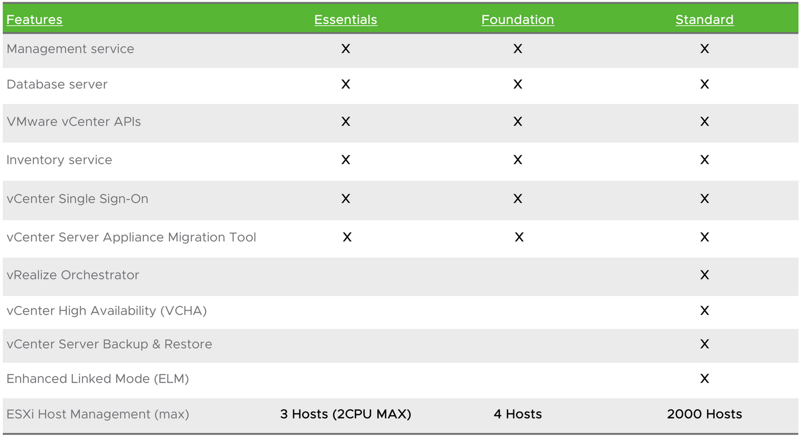

# VMWare

## Hình ảnh so sánh các License VCenter

## Link download

- [VMware-VCSA-all-7.0.0-16189094.iso 6.96 GB](https://mirror.mahanserver.net/VMware/VCenter/7.0.0/VMware-VCSA-all-7.0.0-16189094.iso)
- [VMware-VCSA-all-7.0.0-16386292.iso 6.72 GB](https://mirror.mahanserver.net/VMware/VCenter/7.0.0/VMware-VCSA-all-7.0.0-16386292.iso)
- [VMware-vCenter-Server-Appliance-7.0.0.10300-16189094-patch-FP.iso 4.70 GB](https://mirror.mahanserver.net/VMware/VCenter/7.0.0/VMware-vCenter-Server-Appliance-7.0.0.10300-16189094-patch-FP.iso)
- [VMware-vCenter-Server-Appliance-7.0.0.10300-16189094-updaterepo.zip 4.97 GB](https://mirror.mahanserver.net/VMware/VCenter/7.0.0/VMware-vCenter-Server-Appliance-7.0.0.10300-16189094-updaterepo.zip)
- [VMware_ESXi_7.0.0_16324942_HPE_700.0.0.10.5.5.46_Jun2020.iso  393.88 MB](https://mirror.mahanserver.net/VMware/VCenter/7.0.0/VMware_ESXi_7.0.0_16324942_HPE_700.0.0.10.5.5.46_Jun2020.iso)
- Link tải gốc tại: https://mirror.mahanserver.net/VMware/VCenter/7.0.0/
